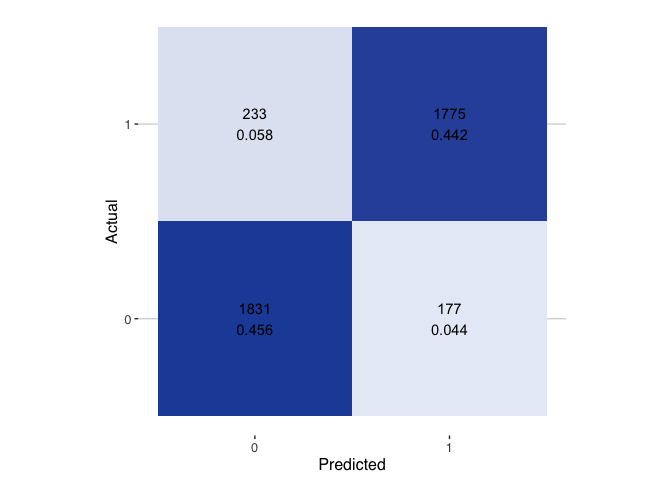
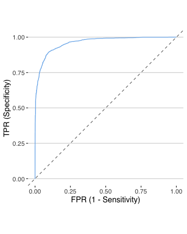
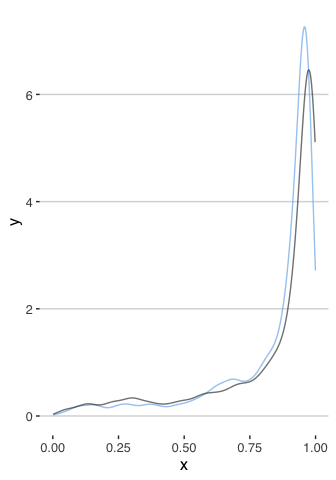

<head>

<link rel="stylesheet" type="text/css" href="https://d335w9rbwpvuxm.cloudfront.net/semantic.min.css"/>’

</head>

<!-- README.md is generated from README.Rmd. Please edit that file -->

# mlgraph 

[](https://travis-ci.org/systats/mlgraph)
[](https://github.com/systats/mlgraph)
[](https://github.com/systats/mlgraph/commits/master)

`mlgraph` provides performance visualizations for standardized ml models
with linear, binary or multi tasks. It is implemented as an extension of
[deeplyr](). At the moment several graphics packages are implemented
including

  - `gg_` ggplot2
  - `hc_` highcharter
  - `ax_` apexcharter

Computations are based on

  - [Metrics](https://github.com/mfrasco/Metrics)
  - [yardstick](https://github.com/tidymodels/yardstick)

Several task specific plots are available:

  - Linear
      - …
  - Binary
      - Confusion Matrix
      - ROC
      - Density
  - Multi
      - Confusion Matrix
      - ROC
      - Density

# Installation

Get the development version from [GitHub](https://github.com/) with:

``` r
# install.packages("devtools")
devtools::install_github("systats/mlgraph")
```

``` r
preds <- readRDS("data/preds.rds") %>% 
  glimpse
#> Observations: 4,016
#> Variables: 7
#> $ pred   <dbl> 0, 1, 0, 0, 0, 1, 1, 1, 0, 0, 1, 0, 0, 1, 0, 0, 1, 0, 0, 1, 0,…
#> $ prob0  <dbl> 0.925, 0.152, 0.698, 0.887, 0.750, 0.046, 0.018, 0.193, 0.874,…
#> $ prob1  <dbl> 0.075, 0.848, 0.302, 0.113, 0.250, 0.954, 0.982, 0.807, 0.126,…
#> $ target <dbl> 0, 0, 1, 0, 1, 1, 1, 1, 0, 0, 1, 0, 0, 1, 0, 0, 1, 0, 0, 1, 0,…
#> $ pol    <dbl> 0, 0, 1, 0, 1, 1, 1, 1, 0, 0, 1, 0, 0, 1, 0, 0, 1, 0, 0, 1, 0,…
#> $ tweet  <chr> "rt @rzhongnotes: salt fat acid heat long ago the four element…
#> $ split  <int> 1, 1, 1, 1, 1, 1, 1, 1, 1, 1, 1, 1, 1, 1, 1, 1, 1, 1, 1, 1, 1,…
```

``` r
df <- mlgraph::eval_classifier(preds, target, pred, prob1) %>% glimpse
#> List of 3
#>  $ confusion:Classes 'tbl_df', 'tbl' and 'data.frame':   4 obs. of  6 variables:
#>   ..$ actual     : Factor w/ 2 levels "0","1": 1 1 2 2
#>   ..$ pred       : Factor w/ 2 levels "0","1": 1 2 1 2
#>   ..$ n          : num [1:4] 1831 177 233 1775
#>   ..$ n_actual   : num [1:4] 2008 2008 2008 2008
#>   ..$ perc_actual: num [1:4] 0.912 0.088 0.116 0.884
#>   ..$ perc_all   : num [1:4] 0.456 0.044 0.058 0.442
#>  $ roc      :Classes 'tbl_df', 'tbl' and 'data.frame':   838 obs. of  4 variables:
#>   ..$ .threshold : num [1:838] -Inf 0.016 0.017 0.018 0.019 ...
#>   ..$ specificity: num [1:838] 1 1 1 1 1 1 1 1 1 1 ...
#>   ..$ sensitivity: num [1:838] 0 0.000498 0.000996 0.00498 0.006972 ...
#>   ..$ .level     : num [1:838] 1 1 1 1 1 1 1 1 1 1 ...
#>  $ dens     :Classes 'tbl_df', 'tbl' and 'data.frame':   1024 obs. of  3 variables:
#>   ..$ x     : num [1:1024] -0.0564 -0.0542 -0.052 -0.0499 -0.0477 ...
#>   ..$ y     : num [1:1024] 0.000134 0.000176 0.000229 0.000296 0.000379 ...
#>   ..$ actual: chr [1:1024] "0" "0" "0" "0" ...
```

``` r
gg_plot_confusion(df$confusion)
```

<!-- -->

``` r
gg_plot_roc(df$roc)
```

<!-- -->

``` r
gg_plot_density(df$dens)
```

<!-- -->
