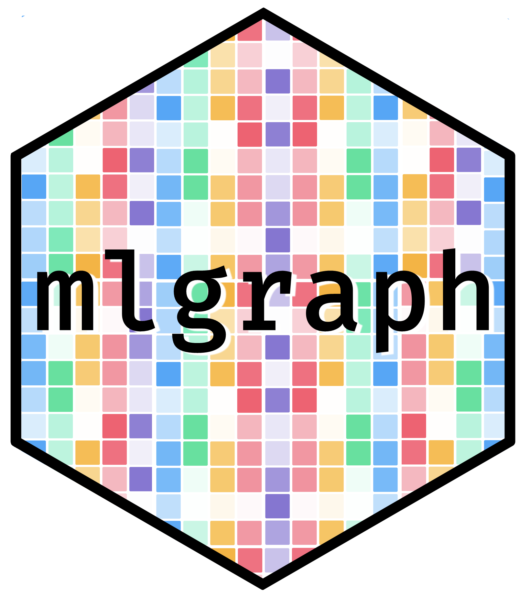

<head>

<link rel="stylesheet" type="text/css" href="https://d335w9rbwpvuxm.cloudfront.net/semantic.min.css"/>’

</head>

<!-- README.md is generated from README.Rmd. Please edit that file -->

# mlgraph 

# Installation

And the development version from [GitHub](https://github.com/) with:

``` r
# install.packages("devtools")
devtools::install_github("systats/mlgraph")
```
